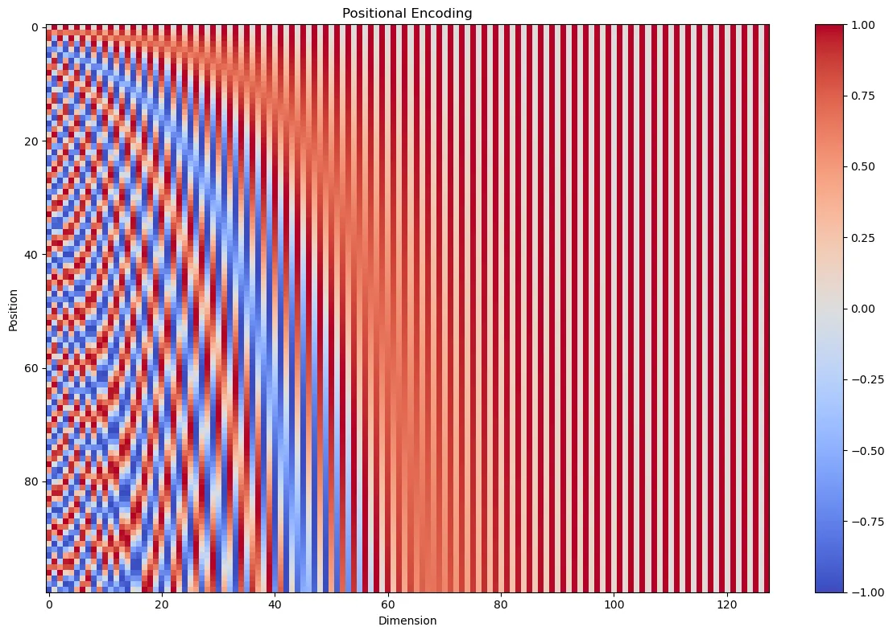

# Rotary Positional Embeddings

## 1. Why this blog

This blog provides an interpretation of Rotary Positional Embeddings (RoPE), exploring the geometry behind the concept and building an intuition for why it works. To understand RoPE, we first must start with Absolute Positional Embeddings (APE) and its limitations.
## 2. Absolute Positional Embeddings (APE)

APE injects positional context into a transformer by adding a position-specific vector to each token's embedding.
These vectors are typically constructed using combinations of sine and cosine functions at different frequencies ????????(they can also be learnable parameters, but the fundamental intuition remains the same).?????????

### Intuition: From Bits to Waves [^1]

#NOTE: STOLEN FROM THE LINK BELOW AS INDICATED BY [^1]

To develop our intuition about absolute positional encoding, let’s start with something fundamental: how we represent numbers in binary.

#### Binary Representation
Consider how we count in binary:

```text
0:  0 0 0 0    8:  1 0 0 0  
1:  0 0 0 1    9:  1 0 0 1  
2:  0 0 1 0    10: 1 0 1 0  
3:  0 0 1 1    11: 1 0 1 1  
4:  0 1 0 0    12: 1 1 0 0  
5:  0 1 0 1    13: 1 1 0 1  
6:  0 1 1 0    14: 1 1 1 0  
7:  0 1 1 1    15: 1 1 1 1  
```

Notice the pattern in how each bit (column) changes:
- The rightmost bit (Least Significant Bit) alternates with every number (frequency: 1/2)
- The second bit from the right alternates every two numbers (frequency: 1/4)
- The third bit alternates every four numbers (frequency: 1/8) 
And so on…

This pattern of different frequencies is the key to positional encoding. But instead of using discrete bits, we can use something smoother: sine and cosine waves.

#### Sinusoidal Positional Encoding
In the original transformer paper, the authors proposed using a combination of sine and cosine functions at different frequencies to encode position. Here’s how it works:

1. For each position in the sequence, we generate a vector of numbers.
2. Each number in this vector is calculated using either a sine or cosine function.
3. We use different frequencies for different dimensions of the vector.



The positional encodings have the same dimension $d_{model}$ as the embeddings, so that the two can be summed, $pos$ is the position and $i$ is the dimension. That is, each dimension of the positional encoding corresponds to a sinusoid.

This plot is analogous to our binary representation table, but with a continuous spectrum instead of discrete 0s and 1s:

1. Each row represents a token in the sequence, similar to how each row in our binary table represented a number.
2. Each column corresponds to a dimension in our tokens encoding, analogous to the bit positions in binary.
3. The colors represent values oscillating between -1 (blue) and 1 (red), which is a continuous version of the 0s and 1s in binary.

**Key Observations:**
- The first row (position 0) is like our binary “0000”, serving as the starting point.
- As we move down the rows (increasing positions), we see patterns of color changes, similar to how bits flip in binary counting.
- The leftmost columns (lower dimensions) change rapidly, like the least significant bits in binary.
- The rightmost columns (higher dimensions) change more slowly, analogous to the most significant bits in binary.

By adding this directly onto the embeddings, the model can look at absolute position and create a grid in its "mental model". While it enables the break of permutation equivariance of attention and injects spatial information for the model, it tends to overfit on this grid structure. REWRITE--This creates spurious relations on these tokens, for example meaning the model cannot extrapolate sequence length properly or learn relational differences instead of overfitting on absolute placement.---

Note that these frequencies can also be made learnable so that the model can choose what patterns/relations are important to remember

### TODO: SOME INTUITION ON WHY FREQUENCIES ARE NICE?? PATTERNS AT STUFF

[^1]: Intuition adapted from [Positional Encoding Explained: A Deep Dive into Transformer PE](https://medium.com/thedeephub/positional-encoding-explained-a-deep-dive-into-transformer-pe-65cfe8cfe10b).

## 3. Rotary Positional Embeddings (RoPE)

STORYLINE: so we want to get rid of this absolute information that causes problems (in some cases we actually do want absolute informaiton as wel, LIKE.... but not relevant for now)

#LETS SAY ROPE IS 1D now
RoPE only works based off of relative position in the axes. This means no absolute positional information can enter the transformers.
Instead of addition, RoPE rotates each token's representation (queries and keys) by a block-diagonal matrix that is based off of its position. For a given position $\mathbf{p}$ and frequency vector $\omega_k$, the 2D rotation matrix block is:

$$
P_{\omega_k}(\mathbf{p}) = 
\begin{pmatrix}
\cos(\omega_k^\top \mathbf{p}) & -\sin(\omega_k^\top \mathbf{p}) \\
\sin(\omega_k^\top \mathbf{p}) & \cos(\omega_k^\top \mathbf{p})
\end{pmatrix}
$$

The full rotation matrix $P_\Omega(\mathbf{p})$ is a block-diagonal matrix made of these 2D rotations for each frequency from $1$ to $d/2$:

$$
P_\Omega(\mathbf{p}) = 
\begin{pmatrix}
\cos(\omega_1^\top \mathbf{p}) & -\sin(\omega_1^\top \mathbf{p}) & 0 & 0 & \cdots & 0 & 0 \\
\sin(\omega_1^\top \mathbf{p}) & \cos(\omega_1^\top \mathbf{p}) & 0 & 0 & \cdots & 0 & 0 \\
0 & 0 & \cos(\omega_2^\top \mathbf{p}) & -\sin(\omega_2^\top \mathbf{p}) & \cdots & 0 & 0 \\
0 & 0 & \sin(\omega_2^\top \mathbf{p}) & \cos(\omega_2^\top \mathbf{p}) & \cdots & 0 & 0 \\
\vdots & \vdots & \vdots & \vdots & \ddots & \vdots & \vdots \\
0 & 0 & 0 & 0 & \cdots & \cos(\omega_{d/2}^\top \mathbf{p}) & -\sin(\omega_{d/2}^\top \mathbf{p}) \\
0 & 0 & 0 & 0 & \cdots & \sin(\omega_{d/2}^\top \mathbf{p}) & \cos(\omega_{d/2}^\top \mathbf{p})
\end{pmatrix}
$$
With RoPE, the dot product inside the attention mechanism mathematically simplifies such that the model always looks at the relational distance (m - n) between tokens instead of their absolute positions (m and n).

$$
s_{ij}(R) = \mathbf{q}_i(R)^\top P_\Omega(\mathbf{p}_j - \mathbf{p}_i)\mathbf{k}_j(R).
$$

Failure Mode: Because it relies strictly on relative angular distances, RoPE struggles with double flipped patches (e.g., 180-degree rotation of pixels in visual tasks), as the relative geometric relationships become mathematically indistinguishable to the model. TODO: CHECK WHY
ECK WHY[Placeholder: Daan's derivations]

$$
f_{\{q,k\}}(\boldsymbol{x}_m, m) = 
\begin{pmatrix}
\cos m\theta & -\sin m\theta \\
\sin m\theta & \cos m\theta
\end{pmatrix}
\begin{pmatrix}
W_{\{q,k\}}^{(11)} & W_{\{q,k\}}^{(12)} \\
W_{\{q,k\}}^{(21)} & W_{\{q,k\}}^{(22)}
\end{pmatrix}
\begin{pmatrix}
x_m^{(1)} \\
x_m^{(2)}
\end{pmatrix}
$$

Ultimately, RoPE is actually just a modulation of the attention scores based off of relative distance and chosen (or learned) frequencies. Note that this is essentially the same as a weighted sum of those frequencies.

## 4. TODO

• How RoPE can look behind or in front of it (positive and negative wavelength part).
• Fourier perspective.
• CAN MODEL SEE GRID BASED ON THIS?